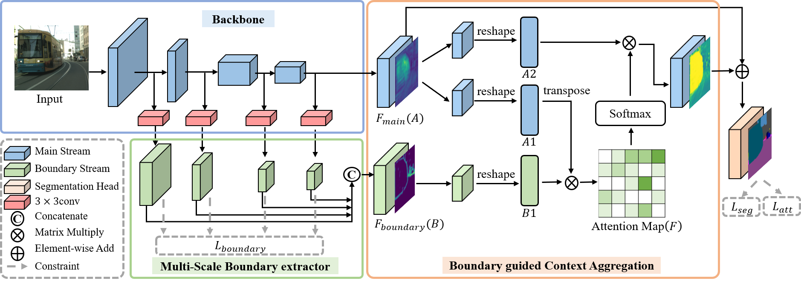

# Boundary-Guided-Context-Aggregation



**Boundary Guided Context Aggregation for Semantic Segmentation**<br>

_Haoxiang Ma, Hongyu Yang, Di Huang_<br>
In BMVC'2021
#### [Paper](https://arxiv.org/pdf/2110.14587.pdf)

## Introduction
This repository is official PyTorch implementation for our BMVC2021 paper.
The code is based on [semseg](https://github.com/hszhao/semseg)

## Environments
- Anaconda3
- Python == 3.7.9
- PyTorch == 1.7.1
- CUDA ==11.0

## Getting Started

### Installation
```
git clone https://github.com/mahaoxiang822/Boundary-Guided-Context-Aggregation.git
cd Boundary-Guided-Context-Aggregation
conda create -n bcanet python=3.7
conda activate bcanet
conda install pytorch==1.7.1 torchvision==0.8.2 torchaudio==0.7.2 cudatoolkit=11.0 -c pytorch
pip install -r requirements.txt
```

### Prepare Datasets
For Cityscapes, you can download from [Cityscapes](https://www.cityscapes-dataset.com/)

For ADE20K, you can download from [ADE20K](http://groups.csail.mit.edu/vision/datasets/ADE20K/)

You should modify your dataset paths specified in folder `config`

### Train

 - Download ImageNet pre-trained from [GoogleDrive](https://drive.google.com/open?id=15wx9vOM0euyizq-M1uINgN0_wjVRf9J3) and put them under folder `initmodel` for weight initialization.
 - Specify the gpu used in config then do training:
 
Cityscapes
```
sh tool/train.sh cityscapes [bcanet50/bcanet101]
```

ADE20K
```
sh tool/trainade.sh ade20k [bcanet50/bcanet101]
```

### Evaluation

 - Specify the gpu used in config and the checkpoint then do training:
 - You can download the pre-trained model on cityscapes from [GoogleDrive](https://drive.google.com/drive/folders/1wHqM2k25ulB6wUB7vxHMuEbAGFfeHH3N?usp=sharing)

Validation on Cityscapes
```
sh tool/test.sh cityscapes [bcanet50/bcanet101]
```

Test on Cityscapes
```
sh tool/test.sh cityscapes [bcanet50/bcanet101]
```

Validation on ADE20K
```
sh tool/testade.sh ade20k [bcanet50/bcanet101]
```

### Citation
If any part of our paper and repository is helpful to your work, please generously cite with:
```
@InProceedings{Ma_2021_BMVC,
    author    = {Haoxiang, Ma and Hongyu, Yang and Huang, Di},
    title     = {Boundary Guided Context Aggregation for Semantic Segmentation},
    booktitle = {The British Machine Vision Conference (BMVC)},
    month     = {November},
    year      = {2021}
```